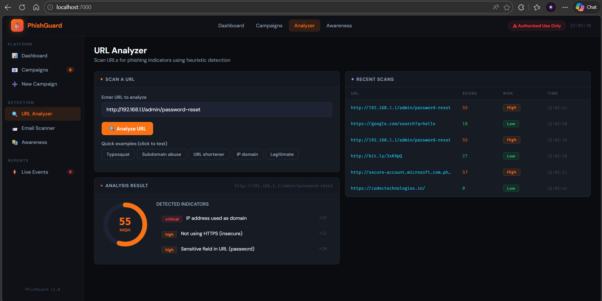
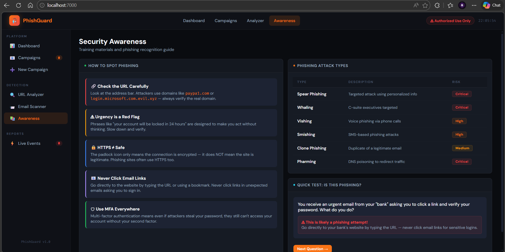
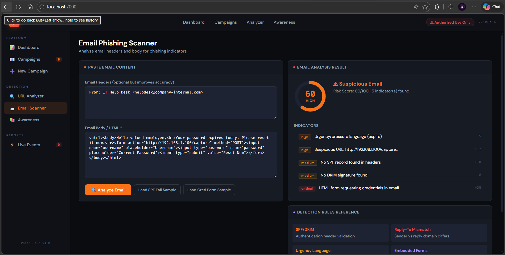

# 🎣 PhishGuard — Phishing Simulation & Detection Platform

> **For authorized security awareness testing only.**

---

## What It Does

PhishGuard is a complete phishing simulation and detection tool with:

| Module | Description |
|--------|-------------|
| **Campaign Manager** | Create, launch, and track phishing email campaigns |
| **5 Email Templates** | Microsoft MFA, Google Workspace, IT Password Reset, PayPal, DocuSign |
| **Landing Pages** | Realistic fake login pages that capture credentials (for testing) |
| **Click/Open Tracking** | Track email opens (pixel), link clicks, and credential submissions |
| **URL Analyzer** | Heuristic scanner for phishing indicators in URLs |
| **Email Scanner** | Analyze email headers + body for SPF/DKIM failures, urgency, spoofing |
| **Awareness Module** | Phishing recognition guide + interactive quiz |
| **Live Event Feed** | Real-time dashboard of all tracking events |
| **CSV Export** | Export campaign results per target |

---

## Quick Start

```bash
pip install flask
python phishguard.py
# Open http://localhost:7000
```

---

## How to Test (Step by Step)

### 1. Create a Campaign

1. Go to **New Campaign** (sidebar or top nav)
2. Fill in:
   - **Campaign Name** — e.g. "Q1 2025 Password Test"
   - **Email Subject** — auto-fills from template
   - **Sender Name / Email** — your "fake" sender
3. Select an **Email Template** (click one of the 5 cards)
4. Add **Targets** — paste one per line:
   ```
   alice@yourcompany.com,Alice,Smith,Engineering
   bob@yourcompany.com,Bob,Jones,Finance
   ```
5. Click **Create Campaign**

### 2. Launch

- Click **🚀 Launch** in Campaign Detail
- **Simulated Mode** (default) — marks targets as sent, no real emails
- **SMTP Mode** — configure your SMTP server to send real emails

### 3. Simulate a Click (Testing)

After launch, grab a target's tracking URL from the DB or logs:
```
http://localhost:7000/click/<token>
```
This opens the fake landing page. Submit any credentials → triggers awareness page.

### 4. Watch the Dashboard

The dashboard auto-refreshes every 5 seconds showing:
- Sent / Opened / Clicked / Submitted counts
- Live event feed
- Campaign funnel chart

---




## URL Analyzer

Go to **Analyzer** and paste any URL. Click **Analyze URL** or use the quick examples:

| Example | What it tests |
|---------|---------------|
| `http://paypa1.com/login` | Typosquatting detection |
| `http://secure.microsoft.com.evil.xyz/verify` | Subdomain abuse |
| `http://bit.ly/abc123` | URL shortener detection |
| `http://192.168.1.1/admin` | IP-as-domain detection |
| `https://google.com` | Should score clean |

**Risk scoring:**
- `0–29` → Low (green)
- `30–54` → Medium (amber)
- `55–79` → High (orange)
- `80–100` → Critical (red)

---

## Email Scanner

Go to **Analyzer → Email Scanner** and:

1. Paste email **headers** (From, Reply-To, Received-SPF, DKIM lines)
2. Paste email **body** (HTML or plain text)
3. Click **Analyze Email**

Or click **Load Sample** buttons to test pre-built phishing examples.

**What it detects:**
- SPF fail / DKIM fail in headers
- Reply-To domain mismatch (spoofed sender)
- Urgency/pressure language keywords
- Embedded credential forms
- Suspicious URLs in body
- Dangerous attachment references
- Generic impersonal greetings

---

## SMTP Setup (Real Email Sending)

When launching a campaign, check **"Use real SMTP server"** and provide:

| Field | Example |
|-------|---------|
| Host | `smtp.gmail.com` |
| Port | `587` |
| Username | `your@gmail.com` |
| Password | Gmail App Password |
| TLS | ✅ checked |

**For Gmail:** You must use an **App Password** (not your regular password).
Generate one at: `myaccount.google.com/apppasswords`

---

## Tracking How It Works

```
Email sent → Target opens email
  └── Tracking pixel (1x1 GIF): /t/<token>.png → logs "opened"
  
Target clicks link
  └── /click/<token> → logs "clicked" → shows fake landing page

Target submits credentials
  └── POST /lp/capture/<token> → logs "submitted" → shows awareness page
```

All events are stored in `phishguard.db` (SQLite).

---

## File Structure

```
phishguard/
├── phishguard.py     ← main app (everything in one file)
├── requirements.txt
├── phishguard.db     ← auto-created on first run
└── phishguard.log    ← auto-created on first run
```

---

## Skills Learned

1. **Phishing Techniques** — understand how real attacks are crafted
2. **Email Security** — SPF, DKIM, DMARC headers and their role
3. **Detection Systems** — heuristic rule-based URL/email analysis
4. **Campaign Tracking** — pixel tracking, click tracking, form capture
5. **Security Awareness** — how to train users to recognize phishing

---

## ⚠ Legal Notice

> Deploy and use **only** on systems and against targets you own or have **explicit written authorization** to test.  
> Sending phishing emails to real people without consent is **illegal** in most jurisdictions.  
> This tool is for **authorized security awareness programs only**.
